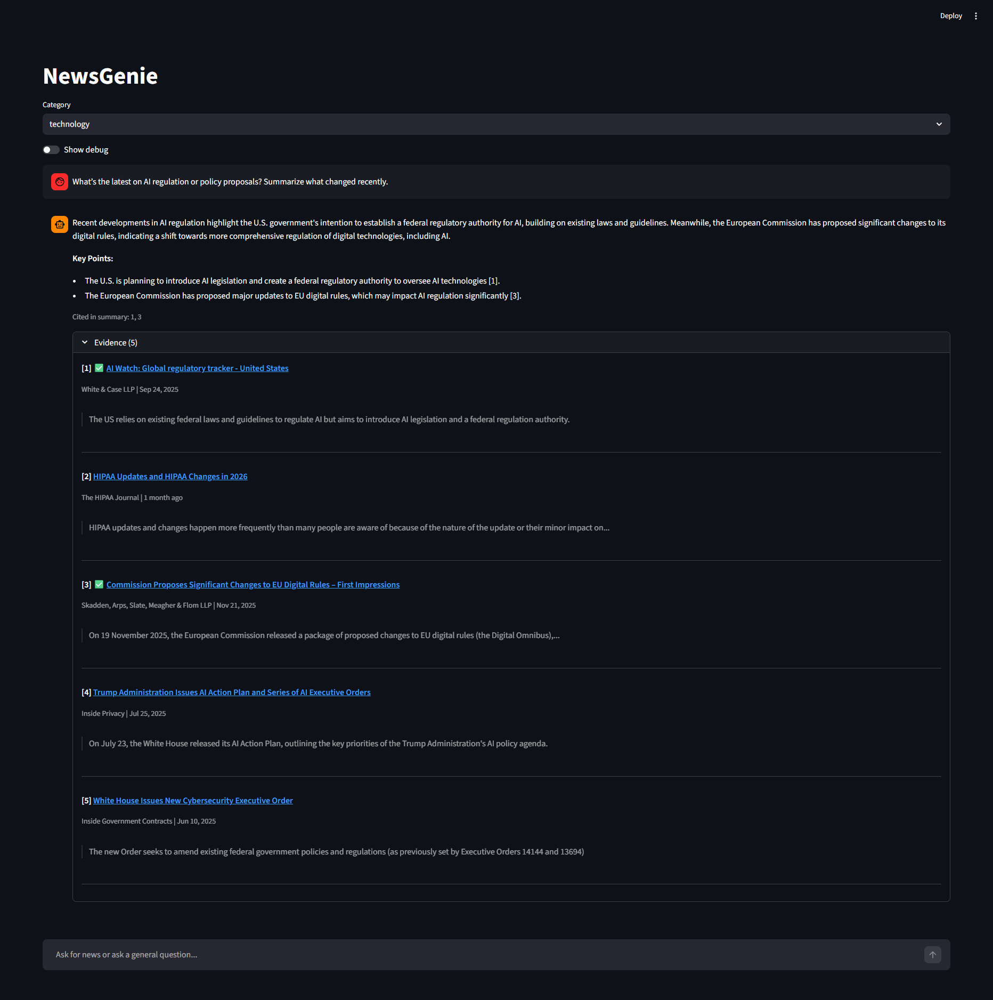
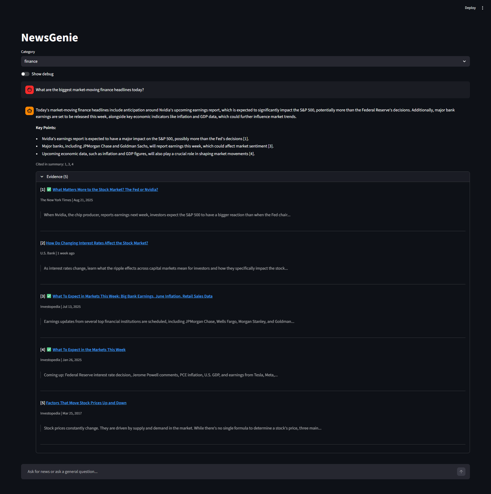
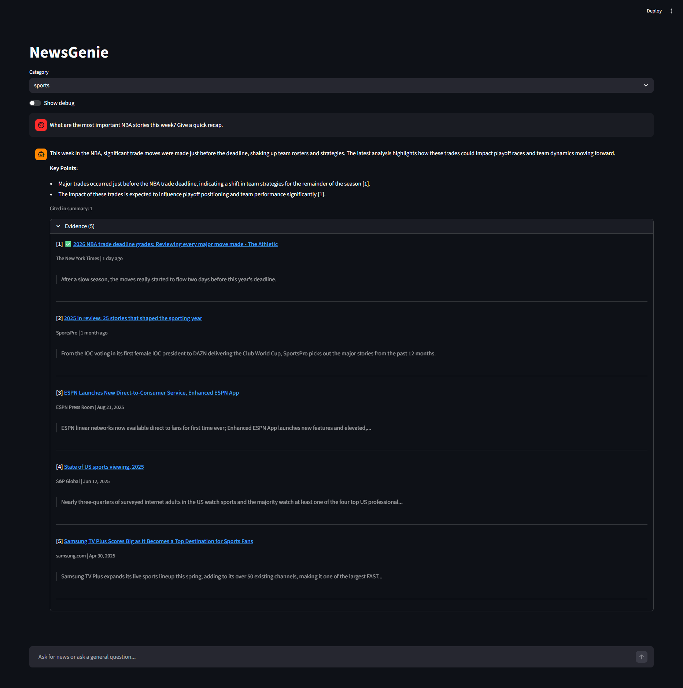
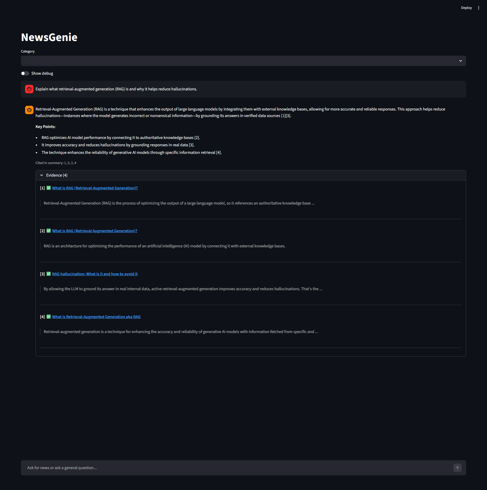
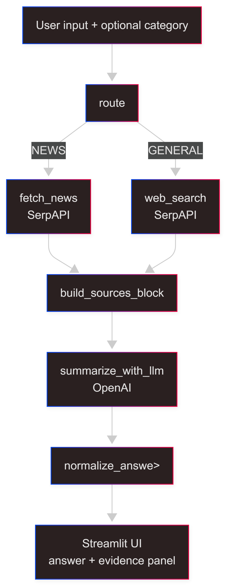

# NewsGenie — Course End Project Report

## Overview

NewsGenie is a unified information and news assistant that:

- Answers general questions conversationally with inline citations
- Provides recent, curated news by category (Technology, Finance, Sports)
- Uses a LangGraph state-machine workflow to route requests, call tools, and handle failures gracefully

Implementation summary:

| Module | Role |
| --- | --- |
| `app.py` | Streamlit chat UI — collects input, invokes the graph, renders answer + evidence panel |
| `graph.py` | LangGraph state machine — routing, tool calls, LLM summarization, post-processing |
| `tools/serpapi_news.py` | SerpAPI news fetcher (Google News via `tbm=nws`) |
| `tools/serpapi_search.py` | SerpAPI web search (Google organic results) |
| `tools/llm.py` | OpenAI Responses API wrapper for source-grounded summarization |
| `utils/sources.py` | Citation utilities — `build_sources_block` (LLM input) and `normalize_answer` (output cleanup) |

## Reliability and Misinformation Mitigation

NewsGenie reduces misinformation and keeps answers verifiable through several mechanisms:

- **Source grounding**: the LLM prompt explicitly restricts the model to use **only** the provided sources and to say so when they are insufficient.
- **Inline citations**: the model produces bracketed numbers (e.g. `[1]`) that map directly to evidence items. Invalid citations (out-of-range indices) are stripped automatically by `normalize_answer`.
- **Evidence panel**: the UI renders a separate, collapsible "Evidence" section listing every fetched source with title, URL, publisher, date, and snippet. Cited sources are marked with a ✅ badge so users can quickly verify claims.
- **Conservative generation**: temperature is set to 0.2 and `max_output_tokens` to 500 to keep answers concise and grounded.

## 1. AI Chatbot Design (Conversation Management + Query Differentiation)

### 1.1 Conversation Management

Guidelines used in this implementation:

- **Session state**: chat history is stored in `st.session_state["messages"]` (a list of `{role, content}`),
  so the UI can re-render the full conversation on every Streamlit rerun.
- **Category state**: the user can set an explicit news category (Technology / Finance / Sports) via a
  dropdown. This is passed to the workflow on each request.
- **Fast response cycle**: the compiled LangGraph is cached with `st.cache_resource` so the graph is built
  once per session (instead of rebuilding on every UI interaction).
- **Response format**: the LLM is instructed to produce:
  1. A short answer (1–3 sentences)
  2. A "Key Points" section as a markdown bullet list with at least one inline citation per point
  3. No separate "Sources:" section — the UI renders evidence separately
- **Grounding**: the LLM is instructed to use **only** the provided sources. If sources are insufficient,
  it must say so.

Context and memory:

- The UI **preserves** chat history for the user, but the current LLM call is intentionally scoped to the
  current question + fetched sources (to keep responses grounded and reduce drift).
- If deeper conversational memory is required, a common extension is to pass the last N messages into the
  graph state and include them in the LLM input.

### 1.2 Query Differentiation (General vs News)

NewsGenie routes each request into one of two modes:

- **NEWS**: fetch recent news and summarize it (category comes from the UI, or is inferred)
- **GENERAL**: run web search and answer using those sources

Routing signals (in priority order):

1. **User-selected category** in the UI ⇒ treat as NEWS.
2. **Domain-specific keyword hints**: if the user message includes finance terms (`stock`, `market`, `crypto`,
   `earnings`, `inflation`, etc.) the category is auto-set to "finance"; similarly for sports terms
   (`nba`, `nfl`, `soccer`, `baseball`, etc.) ⇒ treat as NEWS.
3. **Generic newsy terms**: words like `latest`, `headlines`, `today`, `breaking`, `update` ⇒ treat as NEWS.
4. Otherwise ⇒ treat as GENERAL.

Rationale:

- Category selection is an explicit intent signal, so it wins.
- Domain-specific hints capture topic-related queries that don't use generic news words (e.g. "What's happening with bitcoin?" routes to finance news).
- Generic keyword routing handles users who type "latest news" without selecting a category.

## 2. Real-Time News Integration (Technology / Finance / Sports)

### 2.1 News API (SerpAPI)

- **Provider**: SerpAPI (Google engine)
- **Endpoint**: `https://serpapi.com/search.json`
- **News mode**: sets `tbm=nws` to return news results
- **Common parameters**:
  - `q`: category seed query (+ optional user query)
  - `gl=us`, `hl=en`: US English results
  - `num`: number of results (5 by default)
- **Normalized fields**: `title`, `url`, `source`, `date`, `snippet`

Category seed queries (to improve relevance):

| Category | Seed query |
| --- | --- |
| Technology | `technology ai software cybersecurity` |
| Finance | `finance markets stocks earnings rates inflation` |
| Sports | `sports headlines nfl nba mlb nhl` |

### 2.2 Sample Outputs

> Full query transcripts with evidence details are available in [`example_queries.md`](example_queries.md).

#### Technology

**Query**: *"What's the latest on AI regulation or policy proposals? Summarize what changed recently."*



The assistant identified recent U.S. and EU regulatory developments, citing a White & Case tracker \[1\] and Skadden's analysis of the EU Digital Omnibus \[3\]. The evidence panel shows all 5 fetched sources with ✅ badges on the two cited items.

#### Finance

**Query**: *"What are the biggest market-moving finance headlines today?"*



The assistant summarized Nvidia earnings impact, big bank reporting, and upcoming economic data, citing NYT \[1\], Investopedia \[3\]\[4\]. The evidence panel lists all 5 sources with publisher, date, and snippet.

#### Sports

**Query**: *"What are the most important NBA stories this week? Give a quick recap."*



The assistant focused on the 2026 NBA trade deadline, citing The Athletic via NYT \[1\]. The evidence panel shows all 5 sources including year-end reviews and streaming coverage expansions.

## 3. Web Search Tool Integration (External Resources)

When a request is classified as GENERAL (no news category, no newsy keywords), NewsGenie uses a SerpAPI-backed web search tool that returns organic results and then summarizes them with citations.

- **Provider**: SerpAPI (Google engine)
- **General search mode**: uses `organic_results`
- **Normalized fields**: `title`, `url`, `snippet`

### Sample Output

**Query**: *"Explain what retrieval-augmented generation (RAG) is and why it helps reduce hallucinations."*



The assistant synthesized definitions from AWS \[1\], IBM \[2\], K2View \[3\], and NVIDIA \[4\], explaining that RAG grounds LLM outputs in external knowledge bases to reduce hallucinations. All 4 fetched sources were cited and marked with ✅ in the evidence panel.

## 4. Workflow and Error Handling (LangGraph + Fallbacks)

### 4.1 Workflow Graph (LangGraph)

High-level workflow:

1. **Route**: classify the request as NEWS or GENERAL (using the priority chain described in §1.2)
2. **Fetch**: call the relevant tool (`fetch_news` or `web_search` via SerpAPI)
3. **Format sources**: build a compact numbered sources block for the LLM prompt (`build_sources_block`)
4. **Summarize**: ask the LLM to answer using only those sources (`summarize_with_llm`)
5. **Normalize**: strip any model-emitted "Sources:" section, remove invalid citations, extract cited indices (`normalize_answer`)
6. **Render**: display the answer as markdown, a "Cited in summary" caption, and a collapsible evidence panel



### 4.2 Error Handling and Fallback Mechanisms

Error-handling guidelines implemented across the workflow:

- **Missing API keys**:
  - If `SERPAPI_API_KEY` is missing, the tool raises a clear `RuntimeError`.
  - If `OPENAI_API_KEY` or `OPENAI_MODEL` is missing, the LLM helper raises a clear `RuntimeError`.
- **HTTP failures**:
  - SerpAPI wrappers catch `requests.RequestException` and include the HTTP status code and a short response
    body snippet (up to 500 chars) for debugging.
- **No results**:
  - If the news/search tool returns an empty list, NewsGenie responds with a friendly "no results" message
    (e.g. "No relevant news found. Try a broader query.").
- **LLM failures**:
  - If the LLM call fails for any reason, NewsGenie falls back to returning the raw sources block (so the
    user still receives useful links) and stores the detailed error in `state["error"]` for optional UI display.
- **User-facing vs debug details**:
  - The UI always shows a simple user-facing message.
  - A "Show debug" toggle reveals the full graph state and stored error details for troubleshooting.

## 5. How to Run

1. Create and activate a virtual environment.
2. Install dependencies:

   ```sh
   pip install -r requirements.txt
   ```

3. Create a `.env` file with the required keys:

   ```text
   SERPAPI_API_KEY=your_serpapi_key
   OPENAI_API_KEY=your_openai_key
   OPENAI_MODEL=gpt-4o-mini
   ```

4. Run the UI:

   ```sh
   streamlit run app.py
   ```

## 6. Limitations and Future Improvements

- **Hybrid mode**: add a mode that fetches both news and web results when a question needs both kinds of context.
- **Misinformation resistance**: incorporate domain allowlists, credibility ranking, and/or cross-source agreement checks.
- **Conversational memory**: pass the last N messages into the workflow to support multi-turn follow-up questions.
- **Richer routing**: replace the keyword heuristic with a lightweight classifier or LLM-based intent detection for more accurate routing.
